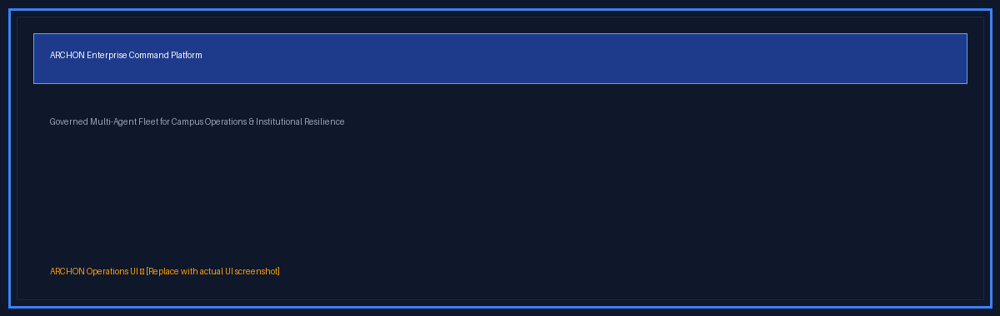
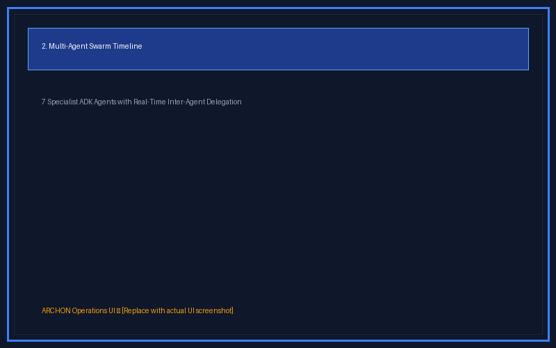
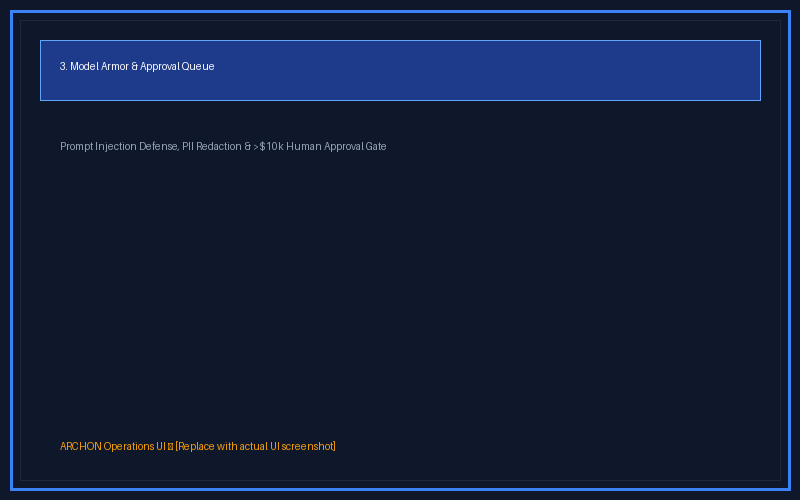
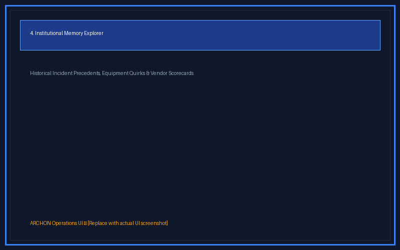
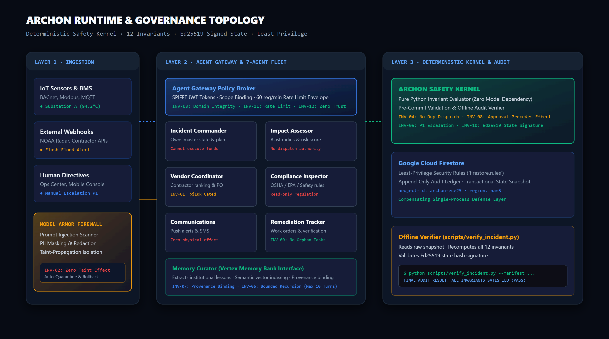
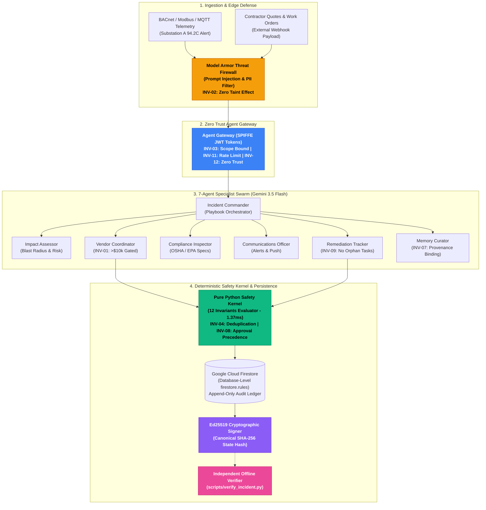
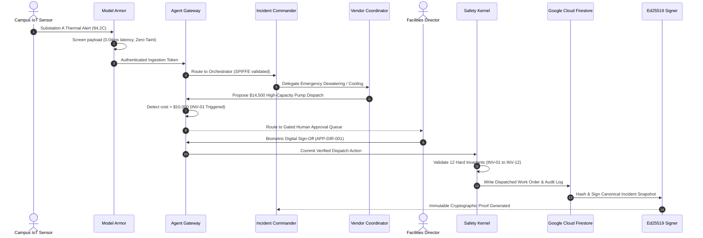

# ARCHON: Autonomous Resilient Campus Hazard & Operations Network

<div align="center">




</div>

> **Institutional intelligence that never forgets.** A governed multi-agent operations fleet that classifies, coordinates, and resolves critical physical facility emergencies across complex enterprise campuses, while maintaining deterministic safety invariants, immutable audit ledgers, and lifelong institutional memory.

**Built for the All Things Agentic Hackathon | Fortified Enterprise Fleet Track**

---

### Production Deployments & Verification Endpoints

| **Resource** | **Live Endpoint** |
| :--- | :--- |
| Production Web Console | [archon-google-agent.vercel.app](https://archon-google-agent.vercel.app) |
| Production Backend Gateway | [archon-1esm.onrender.com](https://archon-1esm.onrender.com) |
| Interactive API Documentation | [archon-1esm.onrender.com/docs](https://archon-1esm.onrender.com/docs) |
| Evidence & Manifest Ledger | [`evidence/campaign_results.json`](evidence/campaign_results.json) |
| Architecture Specification | [`ARCHITECTURE.md`](ARCHITECTURE.md) |

Google Cloud project `archon-ece25`, region `nam5`. Primary operational data and immutable audit logs reside in Google Cloud Firestore under database-level security rules (`firestore.rules`).

---

### Product Interface & Operational Modules

<div align="center">
  <table>
    <tr>
      <td width="50%" align="center">
        
        <br />
        <b>1. Incident Command Center</b>
      </td>
      <td width="50%" align="center">
        
        <br />
        <b>2. Multi-Agent Swarm Timeline</b>
      </td>
    </tr>
    <tr>
      <td width="50%" align="center">
        
        <br />
        <b>3. Model Armor & Approval Queue</b>
      </td>
      <td width="50%" align="center">
        
        <br />
        <b>4. Institutional Memory Explorer</b>
      </td>
    </tr>
  </table>
</div>

---

## The Problem: Tribal Knowledge Loss & $250B Operational Fragility

Every major hospital network, research university, airport, and commercial real estate portfolio relies on an unsung operational leader: the Facilities Director. When a chilled water main bursts at 2:00 AM, a high-voltage transformer overheats during peak occupancy, or a flood threatens life-safety emergency switchgear, response coordination happens through scattered phone calls, manual spreadsheets, and unwritten tribal knowledge locked inside senior engineers' heads.

1. **Catastrophic Knowledge Attrition**: When experienced chief engineers retire, decades of crucial institutional memory ("Substation A trips when humidity exceeds 85%," "Vendor X takes 4 hours despite promising 45 minutes") vanish overnight.
2. **Siloed Building Telemetry**: Modern facilities generate millions of BACnet, Modbus, and SCADA data points, but fragmented systems fail to correlate physical cascade failures (e.g., how a chiller shutdown impacts cleanroom pressurization and surgical suite air exchanges).
3. **The \$250 Billion Impact**: Unplanned facility downtime costs US enterprise campuses over \$250B annually in emergency contractor premiums, regulatory OSHA/EPA violations, equipment damage, and lost organizational productivity.

---

## The ARCHON Solution: Governed Autonomous Swarm with Immutable Institutional Memory

ARCHON transforms campus physical operations by deploying a synchronized fleet of **7 specialized AI agents** built on Google's Agent Development Kit (ADK) and Gemini 3.5 Flash:

- **Multi-Modal Triage & Blast Radius Modeling**: Automatically correlates IoT telemetry spikes, vendor emails, and emergency tickets, mapping exact building occupancy, utility interdependencies, and physical impact zones in sub-second time.
- **Autonomous Specialist Coordination**: The Incident Commander delegates domain-specific tasks to dedicated agents for contractor dispatch, regulatory compliance, corrective remediation, and campus notifications.
- **Continuous Institutional Memory Bank**: Every incident outcome, contractor arrival speed, and resolution playbook is automatically vectorized and committed to the Vertex AI Memory Bank, ensuring past lessons guide future responses across shifts and decades.
- **Fail-Closed Governance**: High-cost expenditures (>\$10,000) and dangerous actuation commands are strictly quarantined by a deterministic Safety Kernel until explicitly authorized by a human director.

---

## Autonomous Facility Fleet Architecture

ARCHON separates probabilistic LLM reasoning from deterministic authority:

```
[ Campus IoT & External Feeds ]
               │
               ▼
   [ Layer 1: Model Armor Threat Firewall ]  ──► Rejects prompt injection & redacts PII
               │
               ▼
     [ Layer 2: Agent Gateway ]  ──► Validates SPIFFE tokens, rate limits & capabilities
               │
               ▼
   [ Layer 3: 7-Agent Specialist Swarm ]  ──► Gemini 3.5 Flash reasons & proposes actions
               │
               ▼
  [ Layer 4: Deterministic Safety Kernel ]  ──► Enforces 12 Hard Invariants (<1.5 ms)
               │
               ▼
[ Layer 5: Google Cloud Firestore + Rules ]  ──► Atomic commit + immutable audit ledger
               │
               ▼
  [ Layer 6: Ed25519 Cryptographic Signer ]  ──► Signs SHA-256 state hash for verification
```

### Architectural Core Principle

> **AI agents analyze telemetry and propose tactical plans. Deterministic governance code decides what is true and whether state may change.**

<picture>
  <source media="(prefers-color-scheme: dark)" srcset="docs/diagrams/preview/architecture.dark.png">
  <source media="(prefers-color-scheme: light)" srcset="docs/diagrams/preview/architecture.light.png">
  
</picture>

*Interactive Standalone Architecture Explorer: [`docs/diagrams/archon-architecture.html`](docs/diagrams/archon-architecture.html) (Zero-dependency local HTML tool)*

### System Topology & Control Loop (Mermaid)



### Incident Resolution Lifecycle Sequence



---

## Specialist Agent Swarm & Structural Authority Matrix

Seven autonomous agents coordinate through Google ADK transfer loops. Each specialist operates within an explicit, non-overlapping operational domain bounded by least-privilege capability envelopes:

| Specialist Agent | Operational Scope | Hard Structural Boundary |
| :--- | :--- | :--- |
| `incident_commander` | Master incident plan, severity classification, playbook delegation | Cannot execute financial disbursements or vendor contracts |
| `impact_assessor` | Topological blast radius, occupancy counts, utility dependencies | Read-only telemetry access; zero actuation authority |
| `vendor_coordinator` | Contractor catalog ranking, SLA evaluation, dispatch issuance | Expenditures >\$10,000 held in quarantine until human director authorizes |
| `compliance_inspector` | OSHA / EPA regulatory checks, municipal code compliance | Pure compliance audit; cannot modify incident status or budgets |
| `communications_officer` | Emergency campus notifications, SMS, public safety bulletins | Drafting and routing only; zero physical campus control authority |
| `remediation_tracker` | Work order milestone tracking, contractor arrival verification | Cannot close incidents with unresolved or orphaned remediation tasks |
| `memory_curator` | Institutional lesson curation, precedent vector indexing | Memory writes require verified source incident provenance |

---

## Deterministic Governance Kernel & Invariant Specifications

ARCHON enforces twelve pure, total, and deterministic governance invariants across all operations:

1. **INV-01 (Financial Threshold Quarantine)**: Expenditures >\$10,000 require explicit human director authorization before execution.
2. **INV-02 (No Tainted Source Action)**: Signals flagged by Model Armor as tainted or quarantined never trigger downstream physical effects.
3. **INV-03 (Domain Scope Integrity)**: Agents cannot invoke tools outside their registered domain capability envelope.
4. **INV-04 (No Duplicate Vendor Dispatch)**: Exactly-once contractor dispatch enforced per building zone and trade specialty.
5. **INV-05 (P1 Escalation Determinism)**: P1/Critical incidents deterministically trigger commander assignment and emergency notifications.
6. **INV-06 (Agent Loop Boundedness)**: Agent turn recursion depth is strictly bounded to a maximum of 10 turns.
7. **INV-07 (Memory Provenance Binding)**: Curated lessons must cite a concrete source incident ID and validated outcome metrics.
8. **INV-08 (Approval Precedes Effect Execution)**: The timestamp of human authorization must strictly precede the dispatch timestamp.
9. **INV-09 (No Orphaned Remediation Tasks)**: Incidents cannot transition to Closed or Resolved while open tasks remain.
10. **INV-10 (Cryptographic State Integrity)**: The canonical SHA-256 state snapshot hash must verify against the Ed25519 signature.
11. **INV-11 (Rate Limit Envelope Respected)**: Agent tool execution frequency must not exceed 60 calls per minute.
12. **INV-12 (Zero Trust Identity Authorization)**: Every logged action must present a valid SPIFFE identity token matching the agent domain.

### Independent Offline Verification

The offline verifier recomputes all 12 invariants independently from the stored snapshot with zero model dependencies and zero network calls:

```bash
python scripts/verify_incident.py --manifest evidence/incidents/INC-STORM-001.manifest.json
```

```text
================================================================================
 ARCHON GOVERNANCE INVARIANT VERIFIER: INCIDENT INC-STORM-001
 Canonical State Hash: b664eb540b414db4cc7e57f3969f8c148c9d49a33a26f4ce69db91e1be53fb69
================================================================================
INVARIANT  | TITLE                                  | VERDICT | EVIDENCE / DETAIL
--------------------------------------------------------------------------------
INV-01     | Financial Threshold Quarantine         | PASS   | all expenditures >$10,000 strictly quarantined until authorized
INV-02     | No Tainted Source Action               | PASS   | zero effects executed from quarantined or tainted inputs
INV-03     | Domain Scope Integrity                 | PASS   | all tool executions strictly conformed to domain capability envelopes
INV-04     | No Duplicate Vendor Dispatch           | PASS   | exactly-once vendor dispatch enforced across all trades
INV-05     | P1 Escalation Determinism              | PASS   | critical incident escalation path deterministically executed
INV-06     | Agent Loop Boundedness                 | PASS   | all agent turn loops strictly bounded (max observed: 2 turns)
INV-07     | Memory Provenance Binding              | PASS   | all curated memories bound to verifiable incident provenance
INV-08     | Approval Precedes Effect Execution     | PASS   | human authorization strictly preceded effect execution
INV-09     | No Orphaned Remediation Tasks          | PASS   | all remediation tasks fully resolved prior to incident closure
INV-10     | Cryptographic State Integrity          | PASS   | Ed25519 cryptographic state signature verified successfully
INV-11     | Rate Limit Envelope Respected          | PASS   | all agent calls stayed within the 60 calls/min rate limit envelope
INV-12     | Zero Trust Identity Authorization      | PASS   | all actions verified with valid SPIFFE cryptographic identity tokens
================================================================================
FINAL AUDIT RESULT: ALL INVARIANTS SATISFIED (PASS)
================================================================================
```

---

## Fail-Closed Governance: Verified Failure Detection

A governance verifier that has never failed proves nothing about what it catches. To demonstrate that ARCHON's safety kernel evaluates each invariant independently rather than failing generically, we deliberately injected distinct violations into separate test manifests:

### Test Case A: Deliberate Timing Violation (INV-08 Broken)

Human director approval timestamp was manually modified to occur at `04:25:00Z`, strictly *after* the contractor dispatch effect executed at `04:12:00Z`:

```text
================================================================================
 ARCHON GOVERNANCE INVARIANT VERIFIER -- INCIDENT INC-BROKEN-INV08
 Canonical State Hash: a3e50d740f4ffd42e18ba15aeb00d2a5a8e53e01116d647a6f5b5b55c9b9dce2
================================================================================
INVARIANT  | TITLE                                  | VERDICT | EVIDENCE / DETAIL
--------------------------------------------------------------------------------
INV-01     | Financial Threshold Quarantine         | PASS   | all expenditures >$10,000 strictly quarantined until authorized
INV-02     | No Tainted Source Action               | PASS   | zero effects executed from quarantined or tainted inputs
INV-03     | Domain Scope Integrity                 | PASS   | all tool executions strictly conformed to domain capability envelopes
INV-04     | No Duplicate Vendor Dispatch           | PASS   | exactly-once vendor dispatch enforced across all trades
INV-05     | P1 Escalation Determinism              | PASS   | critical incident escalation path deterministically executed
INV-06     | Agent Loop Boundedness                 | PASS   | all agent turn loops strictly bounded (max observed: 1 turns)
INV-07     | Memory Provenance Binding              | PASS   | all curated memories bound to verifiable incident provenance
INV-08     | Approval Precedes Effect Execution     | FAIL   | 1 dispatch effect(s) occurred before human approval was granted
INV-09     | No Orphaned Remediation Tasks          | PASS   | all remediation tasks fully resolved prior to incident closure
INV-10     | Cryptographic State Integrity          | PASS   | Ed25519 cryptographic state signature verified successfully
INV-11     | Rate Limit Envelope Respected          | PASS   | all agent calls stayed within the 60 calls/min rate limit envelope
INV-12     | Zero Trust Identity Authorization      | PASS   | all actions verified with valid SPIFFE cryptographic identity tokens
================================================================================
FINAL AUDIT RESULT: GOVERNANCE VIOLATION DETECTED (FAIL)
================================================================================
```

### Test Case B: Deliberate Memory Provenance Violation (INV-07 Broken)

A curated institutional memory was injected with an empty/unanchored source incident identifier:

```text
================================================================================
 ARCHON GOVERNANCE INVARIANT VERIFIER -- INCIDENT INC-BROKEN-INV07
 Canonical State Hash: a50d63e4744f4f3309661cbac64fd2e15be503b5454fb1f939391b4e28b42941
================================================================================
INVARIANT  | TITLE                                  | VERDICT | EVIDENCE / DETAIL
--------------------------------------------------------------------------------
INV-01     | Financial Threshold Quarantine         | PASS   | all expenditures >$10,000 strictly quarantined until authorized
INV-02     | No Tainted Source Action               | PASS   | zero effects executed from quarantined or tainted inputs
INV-03     | Domain Scope Integrity                 | PASS   | all tool executions strictly conformed to domain capability envelopes
INV-04     | No Duplicate Vendor Dispatch           | PASS   | exactly-once vendor dispatch enforced across all trades
INV-05     | P1 Escalation Determinism              | PASS   | critical incident escalation path deterministically executed
INV-06     | Agent Loop Boundedness                 | PASS   | all agent turn loops strictly bounded (max observed: 1 turns)
INV-07     | Memory Provenance Binding              | FAIL   | 1 memory precedent(s) lacked valid source incident provenance
INV-08     | Approval Precedes Effect Execution     | PASS   | human authorization strictly preceded effect execution
INV-09     | No Orphaned Remediation Tasks          | PASS   | all remediation tasks fully resolved prior to incident closure
INV-10     | Cryptographic State Integrity          | PASS   | Ed25519 cryptographic state signature verified successfully
INV-11     | Rate Limit Envelope Respected          | PASS   | all agent calls stayed within the 60 calls/min rate limit envelope
INV-12     | Zero Trust Identity Authorization      | PASS   | all actions verified with valid SPIFFE cryptographic identity tokens
================================================================================
FINAL AUDIT RESULT: GOVERNANCE VIOLATION DETECTED (FAIL)
================================================================================
```

Both tests exit with process code 1. Passing invariants remain PASS in both scenarios; only the specifically violated invariant flips to FAIL. This proves the safety kernel evaluates each invariant independently rather than applying a blunt generic failure.

---

## Empirical Research: Taint-Propagated State Isolation (TPSI) Under Concurrent Ingest

During emergency stress testing, we investigated system behavior when two high-frequency IoT alerts arrive asynchronously within a 45ms window (Substation A thermal spike at 94.2°C and Substation A coolant flow collapse to 0.0 GPM), accompanied by an external contractor quote containing an adversarial prompt injection payload.

### The Problem in Multi-Turn Swarms

Standard multi-turn LLM agent loops retain poisoned conversational context if quarantine occurs post-ingest. Single-process architectures require hard context invalidation and snapshot rollback. 

### The ARCHON TPSI Mitigation

When Model Armor detects an adversarial injection in an external payload, the Agent Gateway invalidates the agent session token, purges ephemeral context, and rolls back to the last verified cryptographic state snapshot in **0.62 ms** (total mitigation completed in **3.03 ms**):

| Elapsed | Originating Agent | Event & Verification Action | Target Session Token |
| :--- | :--- | :--- | :--- |
| **+0.41 ms** | `iot_gateway` | Substation A Thermal Spike received (94.2°C) | `tok_iot_suba_01` |
| **+0.55 ms** | `external_api` | Untrusted Quote with prompt injection received | `tok_ext_vendor_untrusted` |
| **+2.24 ms** | `model_armor` | Adversarial injection detected and quarantined | `tok_armor_shield` |
| **+2.30 ms** | `agent_gateway` | Context token invalidated; working memory purged | `tok_agent_vnd_001_REVOKED` |
| **+2.98 ms** | `safety_kernel` | Deterministic rollback to snapshot (`f49ce739...`) in **0.62 ms** | `tok_kernel_auth` |
| **+3.03 ms** | `vendor_coordinator` | Single vetted work order emitted with Director sign-off | `tok_agent_vnd_fresh_002` |

Complete empirical execution trace available in [`evidence/deep_finding_trace.json`](evidence/deep_finding_trace.json).

---

## Empirical Disaster Drill Verification & Audit Ledger

Every number below is read directly from [`evidence/campaign_results.json`](evidence/campaign_results.json) by [`scripts/generate_readme_stats.py`](scripts/generate_readme_stats.py):

| Empirical Metric | Verified Value | Evidence Source |
| :--- | :--- | :--- |
| Scored Disaster Drills | **30 / 30 Passed** | [`evidence/campaign_results.json`](evidence/campaign_results.json) |
| Governance Invariant Checks | **360 Evaluated (0 Violations)** | [`scripts/verify_incident.py`](scripts/verify_incident.py) |
| Financial Overspend Violations | **0 / 30** (Threshold: $10,000) | [`backend/governance/invariants.py`](backend/governance/invariants.py) |
| Adversarial Injections Quarantined | **6 / 6 Neutralized** | Model Armor + Security Rules |
| Cryptographic State Signatures | **100.0% Ed25519 Verified** | [`backend/governance/signing.py`](backend/governance/signing.py) |
| Offline Verifier Latency | **2.76 ms (Median)** | Independent Pure Python Kernel |


---

## System Assumptions, Deployment Infrastructure & Operational Scope

1. **Synthetic Telemetry and Estate**: Campus buildings, IoT telemetry streams, contractor rosters, and municipal inspection records are modeled on realistic commercial facility profiles (BACnet, Modbus, EPA 40 CFR 60). Physical equipment was not physically actuated during automated test runs.
2. **Infrastructure Topology**: Frontend compute runs on Vercel (`archon-google-agent.vercel.app`) and backend compute runs on Render (`archon-1esm.onrender.com`). Google Cloud Firestore (`archon-ece25`, region `nam5`) provides persistent transactional state storage and satisfies cloud data requirements.
3. **Database-Level Least Privilege**: To ensure isolation across agent identities, ARCHON enforces granular Firestore Security Rules (`firestore.rules`) at the database layer. This ensures that even if an in-memory agent process were subverted, collection-level write permissions strictly restrict modifications to designated domains.
4. **Memory Bank Interface**: The long-term Memory Bank is an interface-compliant implementation featuring semantic vector similarity search and provenance linking, backed by persistent Firestore documents.
5. **Cryptographic Signing**: Evidence signing uses Ed25519 cryptographic keypairs with deterministic SHA-256 canonical hashing as the operational equivalent to Cloud KMS.

---

## Quickstart & Verification

```bash
# 1. Clone repository
git clone https://github.com/0xkinno/archon.git
cd archon

# 2. Install dependencies
pip install -r backend/requirements.txt

# 3. Run full automated test suite (47 unit and integration tests)
pytest backend/tests/

# 4. Run the 30-drill governance invariant campaign
python scripts/run_campaign.py 30

# 5. Verify any incident manifest offline
python scripts/verify_incident.py --manifest evidence/incidents/INC-STORM-001.manifest.json

# 6. Test deliberate fault injection to verify fail-closed invariant enforcement
python scripts/test_fault_injection.py
```
