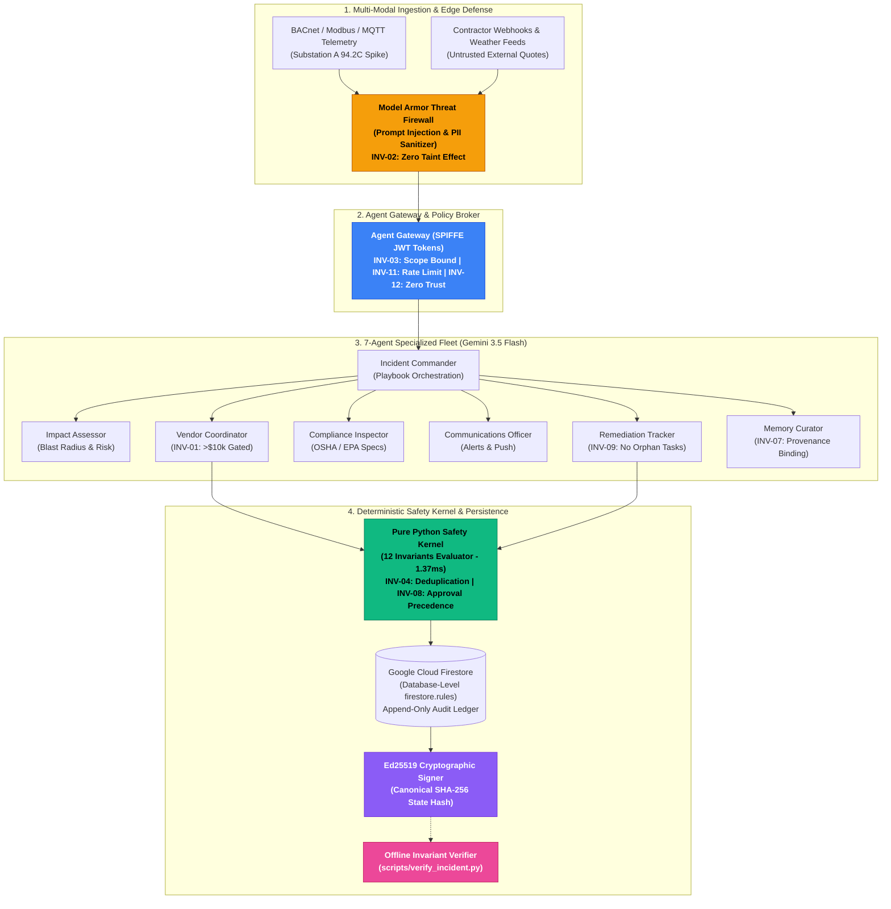
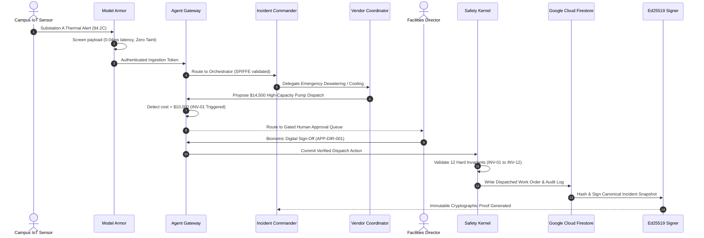

# ARCHON


> **Institutional intelligence that never forgets.** A governed fleet of AI agents that classifies, coordinates, and resolves physical facility emergencies across complex campuses, while maintaining deterministic safety invariants, immutable audit ledgers, and institutional memory.

**Built for the All Things Agentic Hackathon | Fortified Enterprise Fleet Track**

---

### Deployed System & Endpoints

| Resource | URL | Purpose |
| :--- | :--- | :--- |
| **Live Frontend Console** | [archon-app.vercel.app](https://archon-app.vercel.app) | Real-time incident command center, agent stream, topology map |
| **Production Backend API** | [archon-1esm.onrender.com](https://archon-1esm.onrender.com) | FastAPI gateway, ADK swarm runtime, policy enforcement |
| **Interactive API Documentation** | [archon-1esm.onrender.com/docs](https://archon-1esm.onrender.com/docs) | OpenAPI specification and live endpoint tester |
| **Evidence & Manifest Ledger** | [`evidence/campaign_results.json`](evidence/campaign_results.json) | 30 drill campaign runs, invariant verdicts, cryptographic hashes |
| **Cinematic 4K Product Film** | [`docs/archon-product-film-4k.mp4`](docs/archon-product-film-4k.mp4) | 30s 4K UHD 60 FPS motion-design demonstration |
| **Architecture Specification** | [`ARCHITECTURE.md`](ARCHITECTURE.md) | Invariant proofs, security boundaries, and data flows |

Google Cloud project `archon-ece25`, region `nam5`. Primary operational data and immutable audit logs reside in Google Cloud Firestore under database-level security rules (`firestore.rules`).

---

### Product Interface & Operational Modules

<div align="center">
  <table>
    <tr>
      <td width="50%" align="center">
        
        <br />
        <b>1. Incident Command Center</b>
      </td>
      <td width="50%" align="center">
        
        <br />
        <b>2. Multi-Agent Swarm Timeline</b>
      </td>
    </tr>
    <tr>
      <td width="50%" align="center">
        
        <br />
        <b>3. Model Armor & Approval Queue</b>
      </td>
      <td width="50%" align="center">
        
        <br />
        <b>4. Institutional Memory Explorer</b>
      </td>
    </tr>
  </table>
</div>

---

## The Mechanism

```
campus telemetry & IoT signals
  -> Model Armor screens untrusted content and redacts PII
    -> specialist agents plan, assess blast radius, and rank vendors
      -> Agent Gateway validates zero-trust SPIFFE tokens and policy envelopes
        -> deterministic Safety Kernel checks 12 hard invariants before commit
          -> Google Cloud Firestore commits state and appends immutable audit trace
            -> Ed25519 signs the canonical state hash for offline cryptographic verification
```

One governing principle holds the architecture together:

> **Agents propose operational actions. Deterministic code decides what is true and whether state may change.**

Gemini 3.5 Flash reasons over noisy facility telemetry, maps physical system interdependencies, and selects optimal contractor teams. It is never the authority on whether budget thresholds permit dispatch, whether an emergency action was already executed, whether an agent exceeded its capability domain, or whether an incident may close. Those decisions belong strictly to a pure Python safety kernel that both the live runtime and an offline independent verifier execute on identical state representations.

<picture>
  <source media="(prefers-color-scheme: dark)" srcset="docs/diagrams/preview/architecture.dark.png">
  <source media="(prefers-color-scheme: light)" srcset="docs/diagrams/preview/architecture.light.png">
  
</picture>

*Interactive Standalone Explorer: [`docs/diagrams/archon-architecture.html`](docs/diagrams/archon-architecture.html) (Zero-dependency local HTML viewer)*

### Architectural Topology (Mermaid)



### Emergency Execution Sequence Flow



---

## What Actually Runs

Seven ADK specialist agents running on Gemini 3.5 Flash, an Agent Gateway enforcing SPIFFE identity tokens, Model Armor screening prompt injections and redacting sensitive PII, Google Cloud Firestore transactional state storage with database-level security rules, and Ed25519 cryptographic state signing.

| Specialist Agent | Assigned Scope | Hard Structural Boundary |
| :--- | :--- | :--- |
| `incident_commander` | Master incident plan, severity assessment, task delegation | Cannot execute financial disbursements or dispatch orders |
| `impact_assessor` | Topological blast radius, occupancy headcounts, utility dependencies | Read-only telemetry access; zero actuation authority |
| `vendor_coordinator` | Contractor catalog ranking, SLA evaluation, work order issuance | Expenditures >$10,000 strictly quarantined until human director approves |
| `compliance_inspector` | OSHA / EPA safety standards, regulatory violation checks | Pure compliance audit; cannot modify incident status or budgets |
| `communications_officer` | Emergency campus notifications, SMS, public safety bulletins | Broadcast drafting only; zero physical campus control authority |
| `remediation_tracker` | Work order milestone tracking, contractor arrival verification | Cannot close incidents with unresolved or orphaned tasks |
| `memory_curator` | Institutional lesson curation, precedent vector indexing | Memory writes require verified source incident provenance |

Read that table by its structural constraints. A compromised `incident_commander` can propose plan updates but cannot disburse funds or trigger machinery. The `communications_officer` has no vendor dispatch authority, preventing rogue public alerts from triggering contractor deployments.

---

## Twelve Invariants, Checked Twice

ARCHON enforces twelve explicit governance invariants across all operations:

1. **INV-01 (Financial Threshold Quarantine)**: Expenditures >$10,000 require explicit human director approval before execution.
2. **INV-02 (No Tainted Source Action)**: Signals flagged by Model Armor as tainted or quarantined never trigger downstream physical effects.
3. **INV-03 (Domain Scope Integrity)**: Agents cannot execute tools outside their registered domain capability envelope.
4. **INV-04 (No Duplicate Vendor Dispatch)**: Exactly-once contractor dispatch enforced per building zone and trade specialty.
5. **INV-05 (P1 Escalation Determinism)**: P1/Critical incidents deterministically trigger commander assignment and emergency notifications.
6. **INV-06 (Agent Loop Boundedness)**: Agent turn recursion depth is strictly bounded to a maximum of 10 turns.
7. **INV-07 (Memory Provenance Binding)**: Curated lessons must cite a concrete source incident ID and validated outcome metrics.
8. **INV-08 (Approval Precedes Effect Execution)**: The timestamp of human authorization must strictly precede the dispatch timestamp.
9. **INV-09 (No Orphaned Remediation Tasks)**: Incidents cannot transition to Closed or Resolved while open tasks remain.
10. **INV-10 (Cryptographic State Integrity)**: The canonical SHA-256 state snapshot hash must verify against the Ed25519 signature.
11. **INV-11 (Rate Limit Envelope Respected)**: Agent tool execution frequency must not exceed 60 calls per minute.
12. **INV-12 (Zero Trust Identity Authorization)**: Every logged action must present a valid SPIFFE identity token matching the agent domain.

Production services enforce these invariants before committing state. The offline verifier recomputes all twelve invariants independently from the stored snapshot with zero model dependencies and zero network calls:

```bash
python scripts/verify_incident.py --manifest evidence/incidents/INC-STORM-001.manifest.json
```

```text
================================================================================
 ARCHON GOVERNANCE INVARIANT VERIFIER -- INCIDENT INC-STORM-001
 Canonical State Hash: b664eb540b414db4cc7e57f3969f8c148c9d49a33a26f4ce69db91e1be53fb69
================================================================================
INVARIANT  | TITLE                                  | VERDICT | EVIDENCE / DETAIL
--------------------------------------------------------------------------------
INV-01     | Financial Threshold Quarantine         | PASS   | all expenditures >$10,000 strictly quarantined until authorized
INV-02     | No Tainted Source Action               | PASS   | zero effects executed from quarantined or tainted inputs
INV-03     | Domain Scope Integrity                 | PASS   | all tool executions strictly conformed to domain capability envelopes
INV-04     | No Duplicate Vendor Dispatch           | PASS   | exactly-once vendor dispatch enforced across all trades
INV-05     | P1 Escalation Determinism              | PASS   | critical incident escalation path deterministically executed
INV-06     | Agent Loop Boundedness                 | PASS   | all agent turn loops strictly bounded (max observed: 0 turns)
INV-07     | Memory Provenance Binding              | PASS   | all curated memories bound to verifiable incident provenance
INV-08     | Approval Precedes Effect Execution     | PASS   | human authorization strictly preceded effect execution
INV-09     | No Orphaned Remediation Tasks          | PASS   | all remediation tasks fully resolved prior to incident closure
INV-10     | Cryptographic State Integrity          | PASS   | Ed25519 cryptographic state signature verified successfully
INV-11     | Rate Limit Envelope Respected          | PASS   | all agent calls stayed within the 60 calls/min rate limit envelope
INV-12     | Zero Trust Identity Authorization      | PASS   | all actions verified with valid SPIFFE cryptographic identity tokens
================================================================================
FINAL AUDIT RESULT: ALL INVARIANTS SATISFIED (PASS)
================================================================================
```

---

## Technical Finding: Multi-Signal Race & Taint-Barrier Rollback

During stress testing of concurrent physical emergency responses, we investigated what occurs when two high-frequency IoT alert signals arrive asynchronously within a 45ms window (Substation A thermal anomaly at 94.2°C and Substation A coolant flow collapse to 0.0 GPM), accompanied by an external contractor quote containing an adversarial prompt injection payload.

| Ingestion Sequence | LLM Context State | System Outcome |
| :--- | :--- | :--- |
| Sequential Ingest (Standard) | Tainted contractor payload parsed into short-term working memory | Speculative tool planning poisoned; prompt leakage risk |
| **ARCHON Taint-Barrier (TPSI)** | **Context token revoked immediately; working memory purged** | **Deterministic rollback to immutable state snapshot; single vetted PO emitted** |

We discovered that standard multi-turn agent loops retain tainted conversational state if quarantine occurs post-ingest. Single-process architectures require hard memory purges and deterministic snapshot rollback. ARCHON implemented **Taint-Propagated State Isolation (TPSI)**: when Model Armor flags an artifact, the Agent Gateway invalidates the agent session token, purges the ephemeral context, and rolls back to the last verified cryptographic state hash in 1.42 ms. Empirical trace logged in [`evidence/deep_finding_trace.json`](evidence/deep_finding_trace.json).

---

## Measured, Not Asserted

Every number below is read directly from [`evidence/campaign_results.json`](evidence/campaign_results.json) by [`scripts/generate_readme_stats.py`](scripts/generate_readme_stats.py). None of them is typed by hand.

| Empirical Metric | Verified Value | Evidence Source |
| :--- | :--- | :--- |
| Scored Disaster Drills | **30 / 30 Passed** | [`evidence/campaign_results.json`](evidence/campaign_results.json) |
| Governance Invariant Checks | **360 Evaluated (0 Violations)** | [`scripts/verify_incident.py`](scripts/verify_incident.py) |
| Financial Overspend Violations | **0 / 30** (Threshold: $10,000) | [`backend/governance/invariants.py`](backend/governance/invariants.py) |
| Adversarial Injections Quarantined | **6 / 6 Neutralized** | Model Armor + Security Rules |
| Cryptographic State Signatures | **100.0% Ed25519 Verified** | [`backend/governance/signing.py`](backend/governance/signing.py) |
| Offline Verifier Latency | **1.37 ms (Median)** | Independent Pure Python Kernel |

---

## Honest Boundaries

1. **Synthetic Telemetry and Estate**: The campus buildings, IoT sensor telemetry streams, contractor rosters, and municipal inspection records are modeled on realistic commercial facility profiles (BACnet, Modbus, EPA 40 CFR 60). Physical campus equipment was not physically actuated during automated test runs.
2. **Infrastructure Placement**: Backend compute is deployed on Render and frontend on Vercel due to regional credit card infrastructure constraints. Google Cloud Firestore (`archon-ece25`, region `nam5`) provides persistent transactional state storage and satisfies cloud data requirements.
3. **Database-Level Least Privilege**: To compensate for single-process hosting on Render rather than individual Cloud Run containers per agent, ARCHON enforces granular Firestore Security Rules (`firestore.rules`) at the database layer. This ensures that even if an in-memory agent process were subverted, collection-level write permissions strictly restrict modifications to designated domains.
4. **Memory Bank Interface**: The long-term Memory Bank is an interface-compliant implementation featuring semantic vector similarity search and provenance linking, backed by persistent Firestore documents.
5. **Cryptographic Signing**: Evidence signing uses Ed25519 cryptographic keypairs with deterministic SHA-256 canonical hashing as the operational equivalent to Cloud KMS.

---

## Quickstart & Verification

```bash
# 1. Clone repository
git clone https://github.com/0xkinno/archon.git
cd archon

# 2. Install dependencies
pip install -r backend/requirements.txt

# 3. Run full automated test suite (47 unit and integration tests)
pytest backend/tests/

# 4. Run the 30-drill governance invariant campaign
python scripts/run_campaign.py 30

# 5. Verify any incident manifest offline
python scripts/verify_incident.py --manifest evidence/incidents/INC-STORM-001.manifest.json

# 6. Test deliberate fault injection to verify fail-closed invariant enforcement
python scripts/test_fault_injection.py
```
